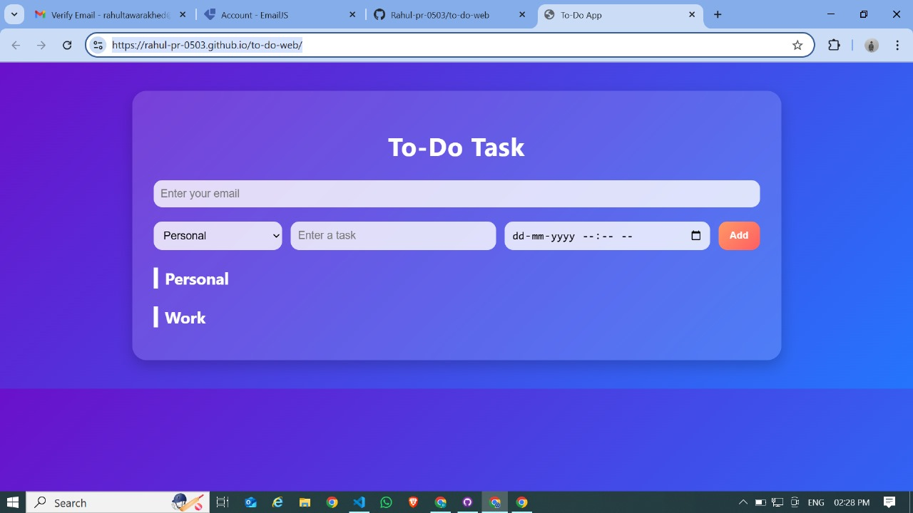

# 📌 To-Do App with Email Reminders

A simple and modern **To-Do List of Task Web App** built using **HTML, CSS, and JavaScript**.  
This app lets users create tasks, organize them into **Personal** and **Work** lists, and get **email reminders 10 minutes before** their tasks start using **EmailJS**.

---

## ✨ Features

- ➕ Add tasks with **title and date/time**
- 📂 Organize tasks into **Personal** and **Work** lists
- ✅ Mark tasks as completed
- 📝 Edit and update existing tasks
- ❌ Delete tasks
- 📧 Enter your **own email address** to receive reminders
- ⏰ Automatic **email alerts 10 minutes before a task**
- 🎨 Unique **modern UI with gradient + glassmorphism design**

---

## 🛠️ Technologies Used

- **HTML5** – structure of the app
- **CSS3** – modern styling with gradient & glassmorphism
- **JavaScript (Vanilla JS)** – app logic (add/edit/delete/alerts)
- **EmailJS** – send task reminders via email without a backend

---

## 📷 Screenshot

